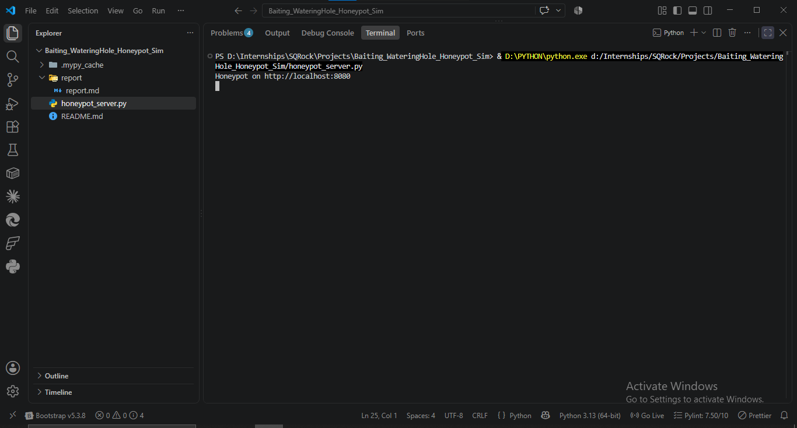
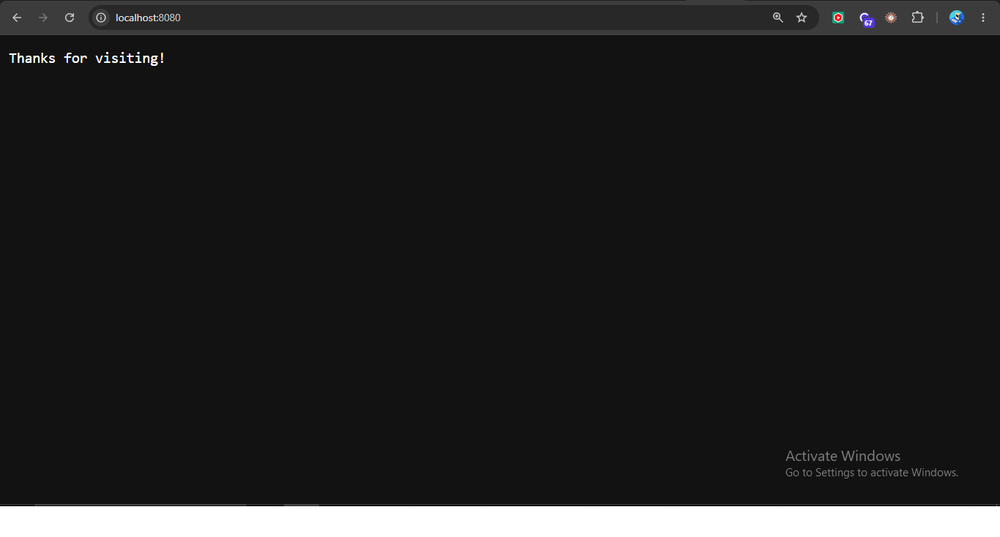
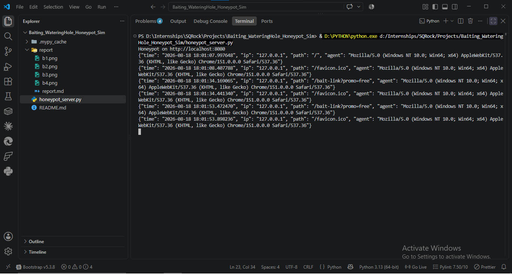
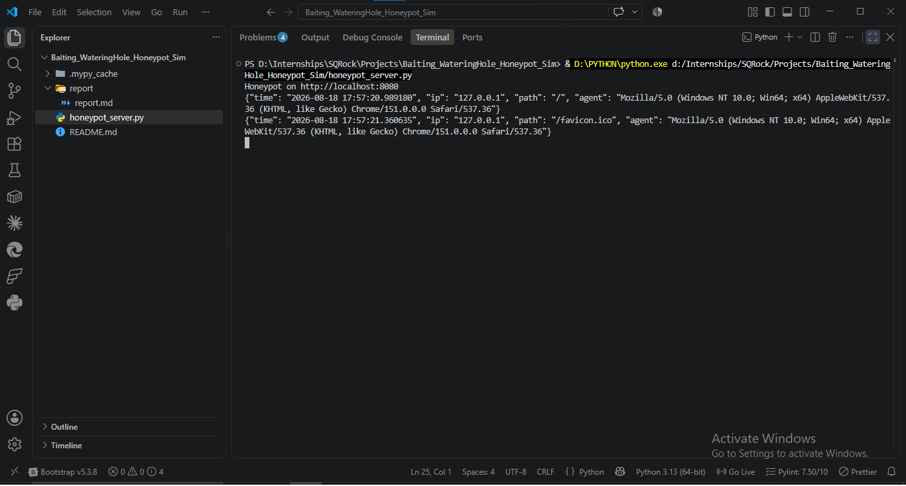
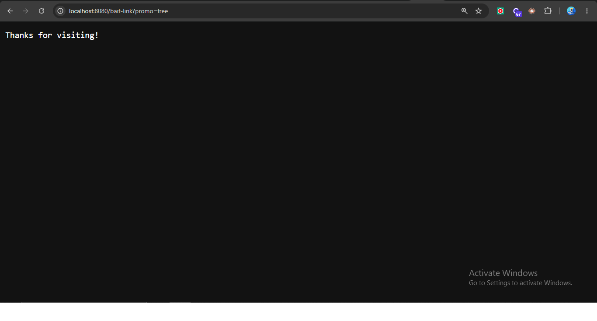
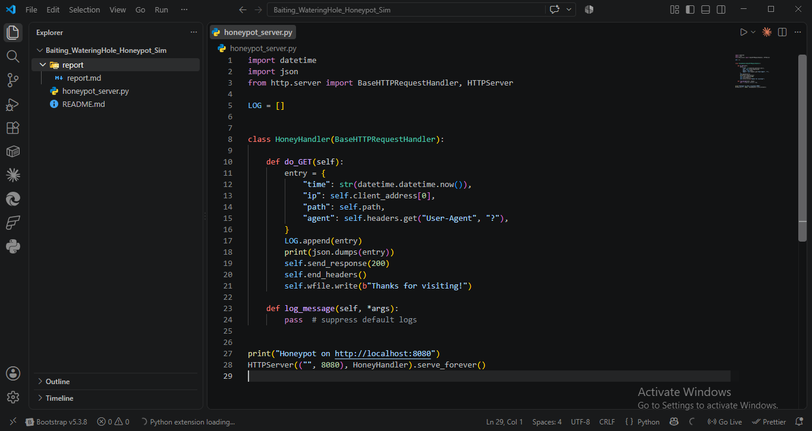
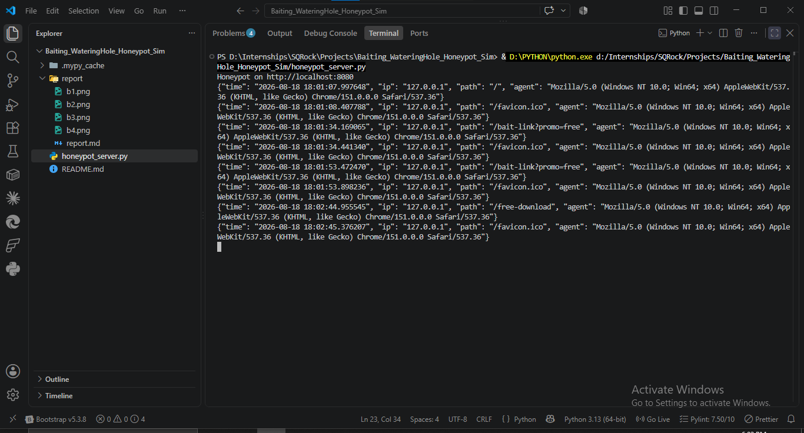
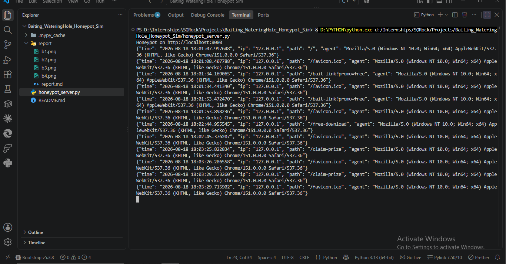
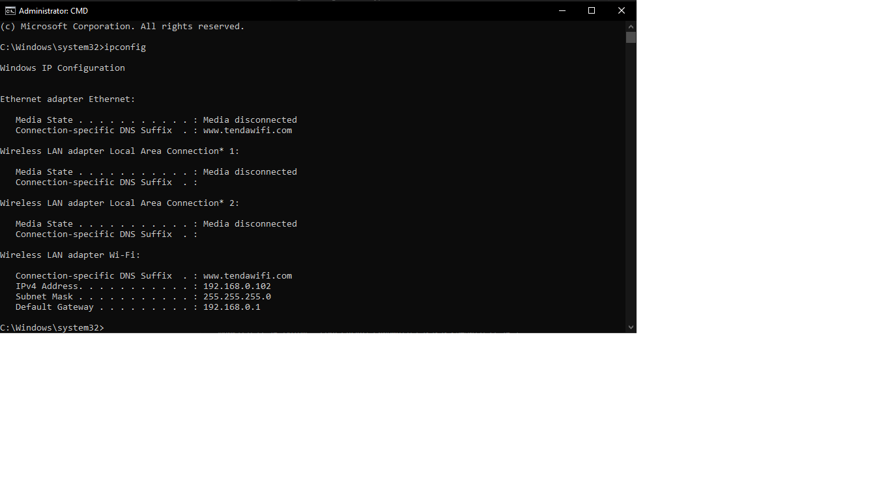

# Report: Baiting & Watering Hole Attack Simulation

## Objective
Understand drive-by download / baiting attack logic and build a honeypot tracker that logs who "clicks" a bait link.

## Theory
- **Baiting**: physical (infected USB, CD) or digital (fake download link, "free prize" offer) traps designed to lure a target into interacting.
- **Watering hole attack**: attacker compromises a legitimate site the target frequently visits, rather than attacking the target directly.
- **Defense**: web filtering/URL reputation checks, script blocking (NoScript/browser isolation), timely patch management to reduce compromised-site risk.

## Setup
`honeypot_server.py` runs a lightweight HTTP server (`http.server` stdlib) on port 8080. Every GET request — regardless of path — is logged with timestamp, source IP, requested path, and User-Agent, then served a generic "Thanks for visiting!" page.

## Execution

### Server startup

### Network context
Confirmed local IP for lab context (192.168.0.102, localhost testing on same machine).

### Simulated victim visits
Visited the root path and several bait-styled endpoints to simulate different lure links a real attacker might use.

Additional simulated paths hit: `/bait-link?promo=free`, `/free-download`, `/claim-prize` — each representing a different social-engineering lure theme (promo, free download, prize claim).

### Captured logs

## Log Analysis

| Time | IP | Path | Notes |
|------|-----|------|-------|
| 18:01:07 | 127.0.0.1 | / | Initial root visit |
| 18:01:08 | 127.0.0.1 | /favicon.ico | Browser auto-request |
| 18:01:34 | 127.0.0.1 | /bait-link?promo=free | Simulated bait click #1 |
| 18:01:53 | 127.0.0.1 | /bait-link?promo=free | Simulated bait click #2 |
| 18:02:44 | 127.0.0.1 | /free-download | Simulated bait click #3 |
| 18:03:25 | 127.0.0.1 | /claim-prize | Simulated bait click #4 |
| 18:03:29 | 127.0.0.1 | /claim-prize | Simulated bait click #5 |

All requests originated from the same local source (127.0.0.1) using a consistent Chrome/151.0.0.0 User-Agent — expected in a single-machine lab test. In a real deployment, this log would surface distinct external IPs and varied User-Agents, which is the actual signal analysts use to fingerprint and count unique victims.

## MITRE ATT&CK Mapping
| TTP ID | Tactic | Technique |
|--------|--------|-----------|
| T1204.001 | Execution | User Execution: Malicious Link |
| T1608 | Resource Development | Stage Capabilities |
| T1189 | Initial Access | Drive-by Compromise |

## Detection / Defense Notes
- **Web filtering**: block known malicious/bait domains at DNS or proxy level before the click resolves.
- **Browser hardening**: script-blocking extensions (NoScript), disable auto-download prompts.
- **Patch management**: watering hole attacks rely on exploiting outdated browser/plugin vulnerabilities on legitimate compromised sites — timely patching closes this window.
- **Log correlation**: repeated hits to bait-styled paths (`/free-*`, `/claim-*`, `/promo=*`) from the same or clustered IPs in a short window is a strong indicator of an active baiting campaign — worth a Splunk/SIEM alert rule.
- Sample detection query: `sourcetype=honeypot_log path IN ("*bait*","*free*","*claim*") | stats count by ip | where count > 1`

## Deliverable Status
✅ Honeypot server demo
✅ Log analysis of captured simulated "victim" visits
✅ Mitigation report