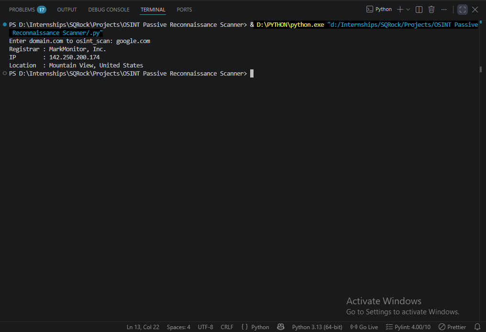
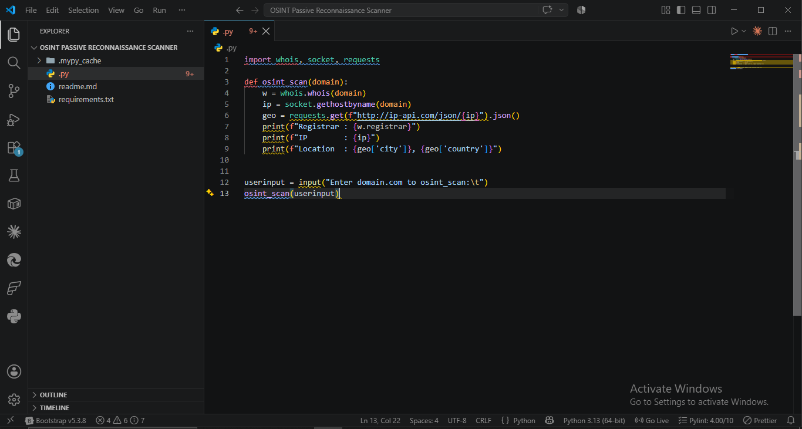
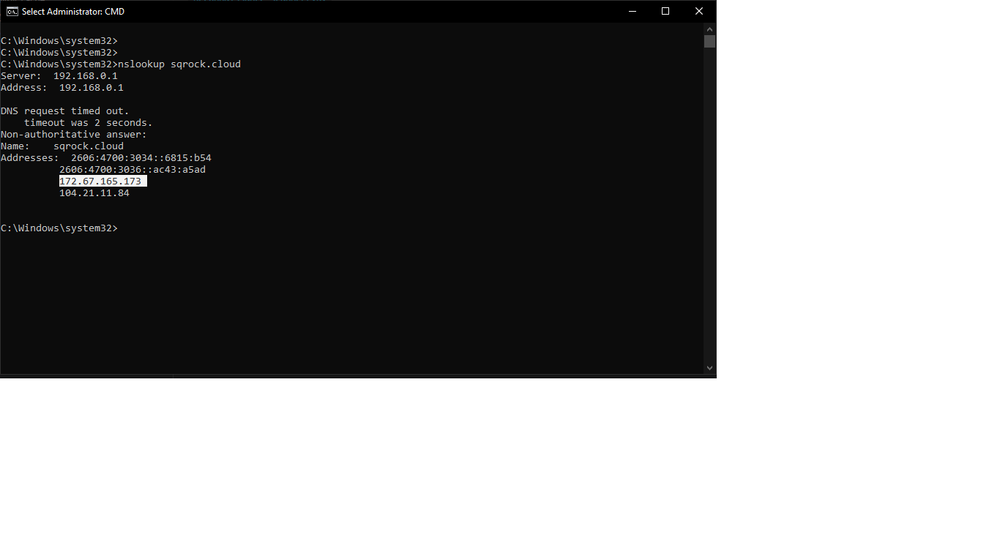
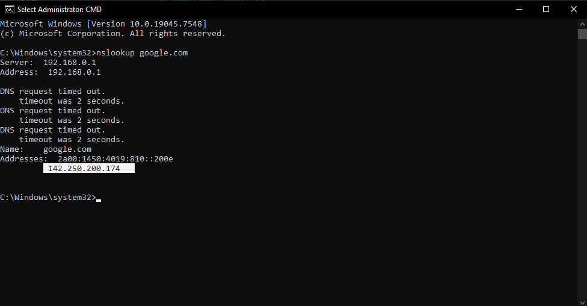

# OSINT Passive Reconnaissance — Report

**Analyst:** Mudasir Zia | **Date:** 2026-08-11 | **Tool:** osint_scanner.py

## Objective
Gather passive OSINT (WHOIS, DNS, IP geolocation) on target domains without direct contact, using only public-source APIs.

## Methodology
1. `whois.whois(domain)` → registrar, org, dates
2. `socket.gethostbyname(domain)` → resolves domain to IPv4
3. `requests.get(ip-api.com)` → maps IP to geolocation

## Test Domains

| Domain | Registrar | IP | Location |
|---|---|---|---|
| sqrock.cloud | HOSTINGER operations, UAB | 172.67.165.173 | Toronto, Canada |
| google.com | MarkMonitor, Inc. | 142.250.200.174 | Mountain View, United States |

## Screenshots

## Verification
Cross-checked script IP output against `nslookup` in CMD — IPs matched in both cases, confirming DNS resolution accuracy. Note: Cloudflare-fronted domains (sqrock.cloud) return the CDN edge IP/location, not the origin server — geolocation reflects Cloudflare PoP, not actual hosting location.

## Key Finding
IP geolocation via ip-api.com is CDN-aware only at the IP level — it can't distinguish reverse-proxy IPs (Cloudflare) from origin server IPs. Registrar data (WHOIS) is more reliable for identifying actual business/hosting entity.

## Passive vs Active
All steps used public data sources (WHOIS registries, DNS, geo-IP databases). Zero packets sent directly to target beyond standard DNS resolution — no scanning, no service enumeration, no active probing.