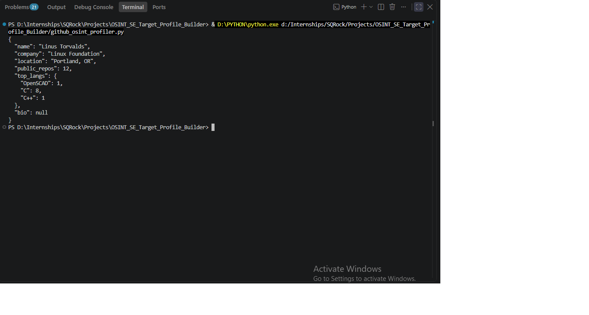
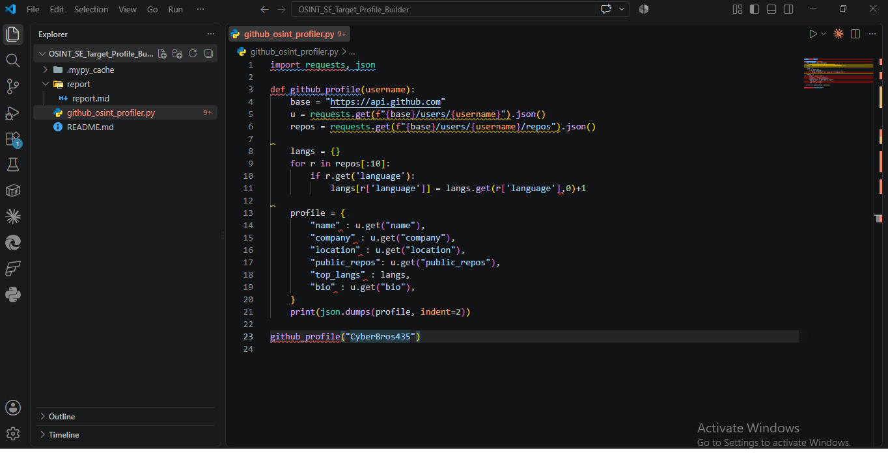
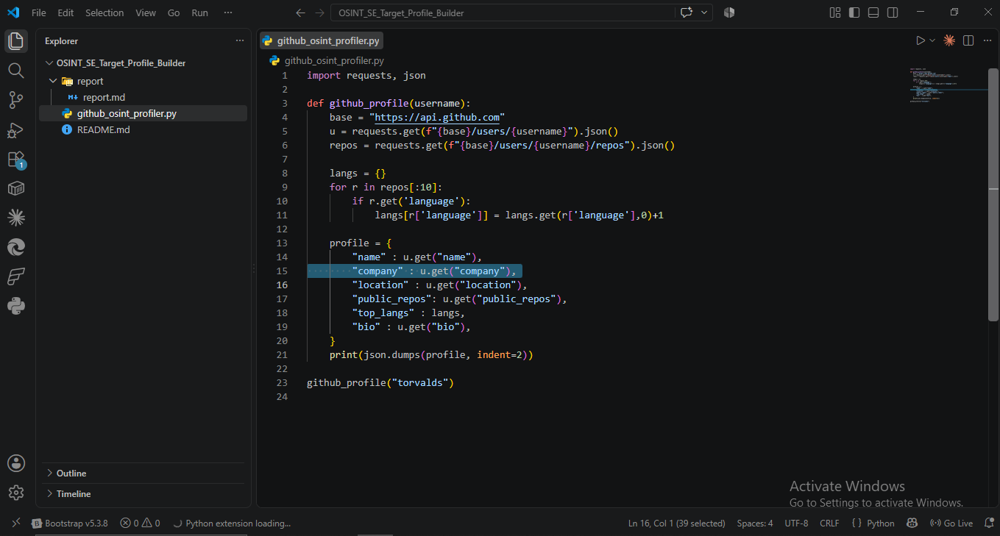
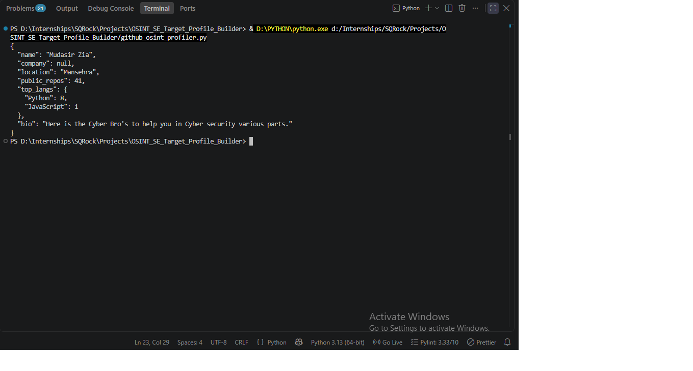

# OSINT + SE: Target Profile Builder — Report

**Analyst:** Mudasir Zia | **Date:** 2026-08-12 | **Tool:** github_osint_profiler.py

## Objective
Aggregate public GitHub data into a structured target profile JSON, demonstrating SE recon methodology.

## Screenshots

## Test Results

| Field | CyberBros435 | torvalds |
|---|---|---|
| Name | Mudasir Zia | Linus Torvalds |
| Company | null | Linux Foundation |
| Location | Mansehra | Portland, OR |
| Public Repos | 41 | 12 |
| Top Languages | Python: 8, JavaScript: 1 | C: 8, OpenSCAD: 1, C++: 1 |
| Bio | "Here is the Cyber Bro's to help you in Cyber security various parts." | null |

## Findings
- **Exposed attack surface (CyberBros435)**: bio directly states "Cyber security" focus + location — an attacker could craft a cybersecurity-themed pretext (fake CTF invite, fake job offer in the field) knowing the target's actual interest area.
- **torvalds profile**: minimal exposure — no bio, company/location present but no personal detail beyond org affiliation. Lower-value SE target from GitHub alone; tech stack (C/C++) still reveals kernel/systems-dev pretext angle.
- **Language distribution** directly maps to tech-stack pretexting: a Python-heavy profile invites "your PyPI package has a vulnerability" style phishing; a C/kernel profile invites fake CVE/patch-review lures.

## Defender Recommendations
1. Remove or genericize bio if it states specialty (reduces pretext precision)
2. Avoid listing location unless required for the account's purpose
3. Be aware repo languages alone reveal enough to craft targeted technical phishing