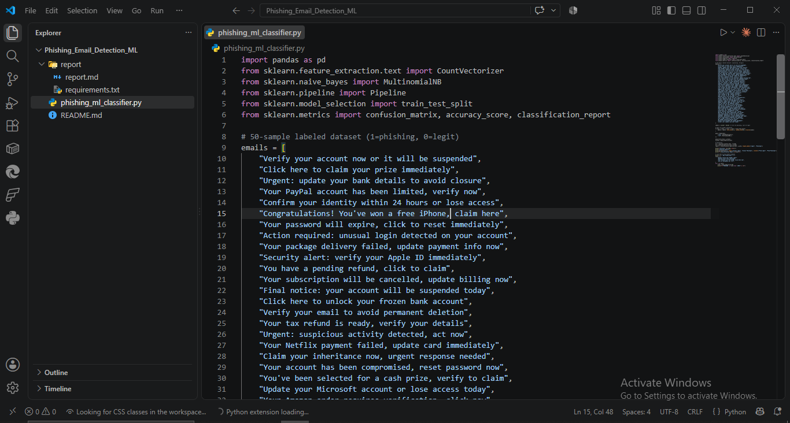
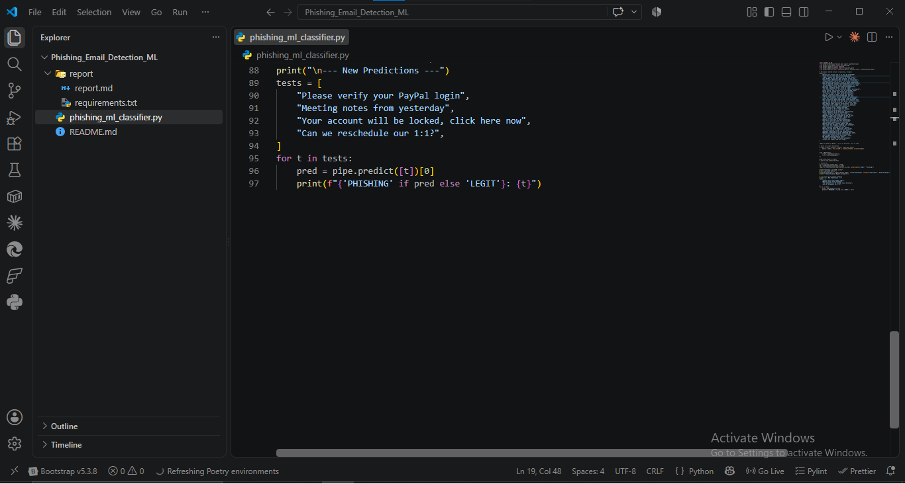
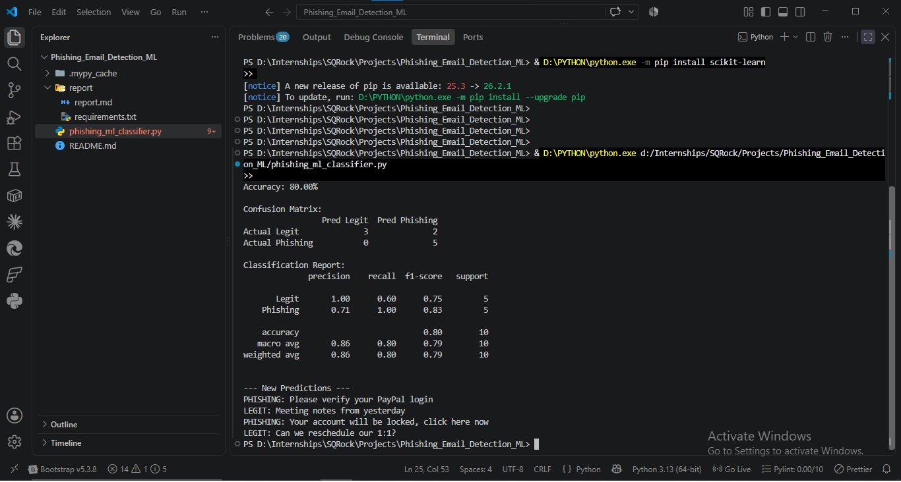
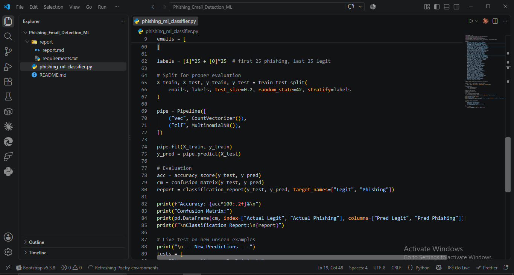
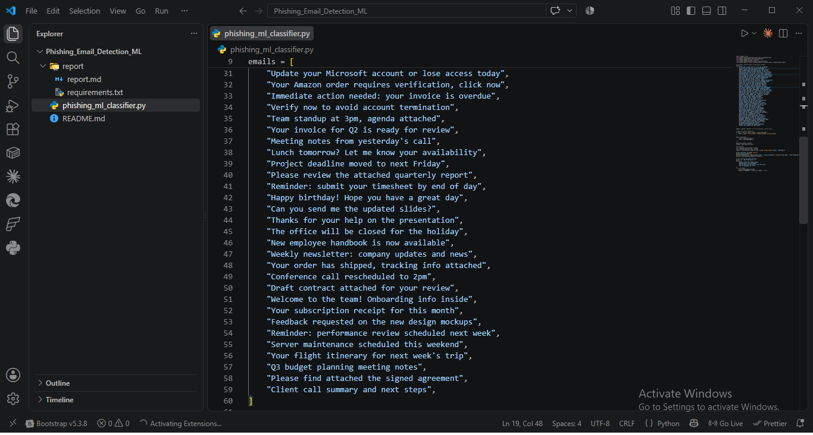

# Phishing Email Detection with ML — Report

**Analyst:** Mudasir Zia | **Date:** 2026-08-19 | **Tool:** phishing_ml_classifier.py

## Objective
Train a Naive Bayes classifier on 50 labeled emails to detect phishing, evaluate with confusion matrix + accuracy, test on unseen examples.

## Screenshots

## Dataset
50 samples: 25 phishing (urgency/verify/claim/suspended patterns), 25 legit (meetings, invoices, routine work emails). Split 80/20 train/test, stratified.

## Results

**Accuracy: 80.00%**

**Confusion Matrix:**
| | Pred Legit | Pred Phishing |
|---|---|---|
| Actual Legit | 3 | 2 |
| Actual Phishing | 0 | 5 |

**Classification Report:**
| Class | Precision | Recall | F1-score | Support |
|---|---|---|---|---|
| Legit | 1.00 | 0.60 | 0.75 | 5 |
| Phishing | 0.71 | 1.00 | 0.83 | 5 |

## New Predictions (Unseen Data)
| Email | Prediction |
|---|---|
| "Please verify your PayPal login" | PHISHING |
| "Meeting notes from yesterday" | LEGIT |
| "Your account will be locked, click here now" | PHISHING |
| "Can we reschedule our 1:1?" | LEGIT |

All 4 unseen predictions correct.

## Findings
- **Recall on phishing = 1.00**: model never misses a phishing email in the test set — the safer failure mode for a security tool (false negatives are costlier than false positives)
- **Precision on legit = 1.00, recall = 0.60**: 2 legit emails were misclassified as phishing (false positives) — likely contained overlapping words with phishing patterns (e.g. "update," "review")
- **80% accuracy on only 10 test samples** is a small-sample result — task theory claims 95%+ is achievable with proper training; this dataset size is a floor demonstration, not production-grade

## Limitation
Small dataset (50 samples) limits generalization. Bag-of-words (CountVectorizer) has no semantic understanding — a legit email using words like "verify" or "account" in normal context can trigger false positives. Production systems add: TF-IDF weighting, n-grams, URL/domain-based features, and much larger training corpora (thousands of samples) to close this gap toward the 95%+ theoretical ceiling.