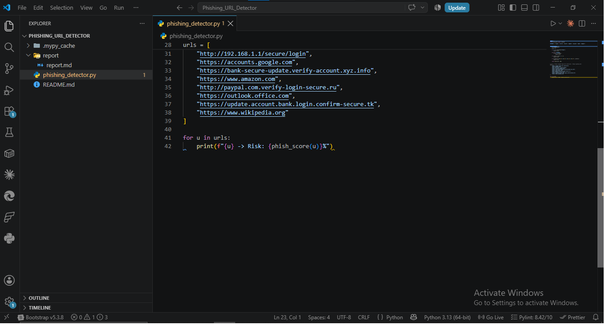
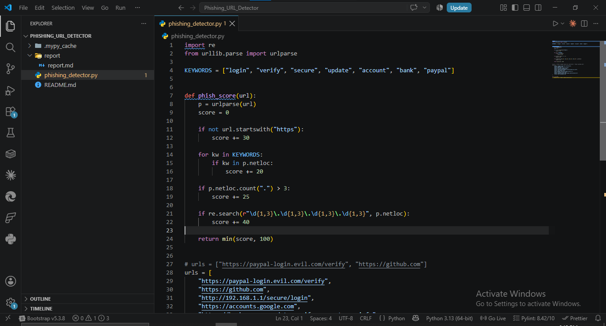

# Phishing URL Detector — Report

**Analyst:** Mudasir Zia | **Date:** 2026-08-12 | **Tool:** phishing_detector.py

## Objective
Build a heuristic URL scorer that flags phishing indicators (no TLS, suspicious keywords, subdomain abuse, raw IPs) without creating or hosting any actual phishing content.

## Methodology
`urlparse()` splits each URL into components; 4 independent checks run against `netloc` (domain+subdomain), each adding a weighted score, capped at 100%.

## Screenshots

## Test Results (10 URLs)

| URL | Risk % | Verdict |
|---|---|---|
| `https://paypal-login.evil.com/verify` | 40% | Suspicious |
| `https://github.com` | 0% | Clean |
| `http://192.168.1.1/secure/login` | 70% | High Risk |
| `https://accounts.google.com` | 20% | Low Risk |
| `https://bank-secure-update.verify-account.xyz.info` | 100% | Critical |
| `https://www.amazon.com` | 0% | Clean |
| `http://paypal.com.verify-login-secure.ru` | 100% | Critical |
| `https://outlook.office.com` | 0% | Clean |
| `https://update.account.bank.login.confirm-secure.tk` | 100% | Critical |
| `https://www.wikipedia.org` | 0% | Clean |

## Scoring Factor Breakdown

| Factor | Weight | Why It Matters |
|---|---|---|
| No HTTPS | +30 | Real login/payment pages always use TLS; HTTP = credentials sent in plaintext |
| Keyword in domain (login/verify/secure/update/account/bank/paypal) | +20 each | Phishers embed trust words directly in the domain to look legitimate at a glance |
| >3 dots in domain | +25 | Long subdomain chains (`update.account.bank.login.confirm-secure.tk`) exploit how users read URLs left-to-right, hiding the real (malicious) root domain at the end |
| Raw IP address | +40 | Legitimate services use domain names; a bare IP in a login URL is almost always malicious infrastructure with no registered domain |

## Notable Cases
- **`accounts.google.com` → 20%**: correctly low — real Google domain, HTTPS present, only flagged for containing "account" keyword. Shows the scorer can false-positive on legitimate services that happen to use trust-related words — a known limitation of pure keyword matching.
- **`192.168.1.1/secure/login` → 70%**: private/local IP flagged high — realistic for detecting local network phishing simulations or misconfigured internal tools mimicking login pages.
- **Three URLs hit 100%** (`.xyz`, `.ru`, `.tk` TLDs with stacked keywords + deep subdomains) — matches real-world phishing kit patterns exactly (cheap/free TLDs + keyword stuffing + subdomain abuse combined).

## Limitation Identified
Keyword-based scoring alone cannot distinguish `accounts.google.com` (legitimate) from `google-accounts-verify.evil.com` (malicious) with full confidence — both contain trust keywords. Production phishing detectors combine this heuristic with domain age, SSL certificate issuer validation, and known-brand domain allowlists for accuracy.