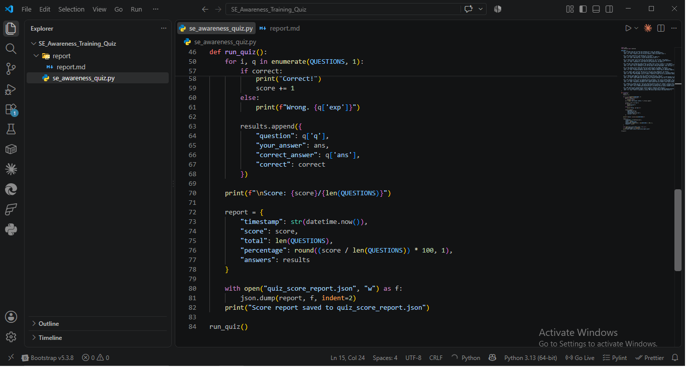
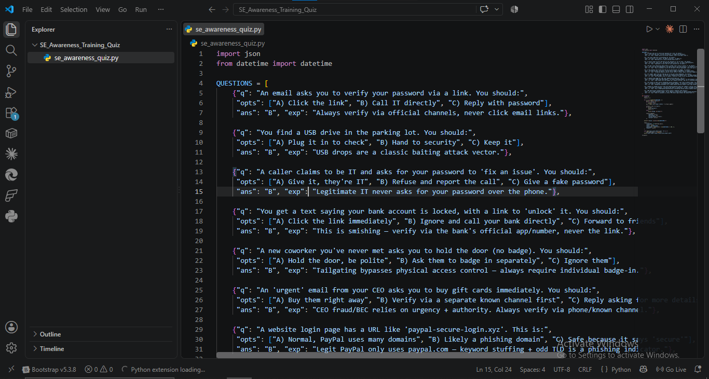
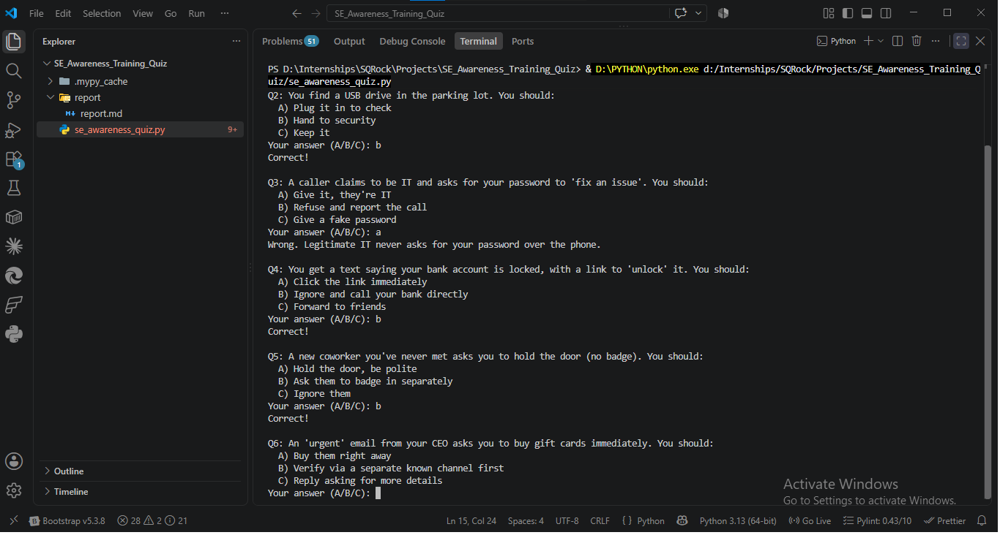
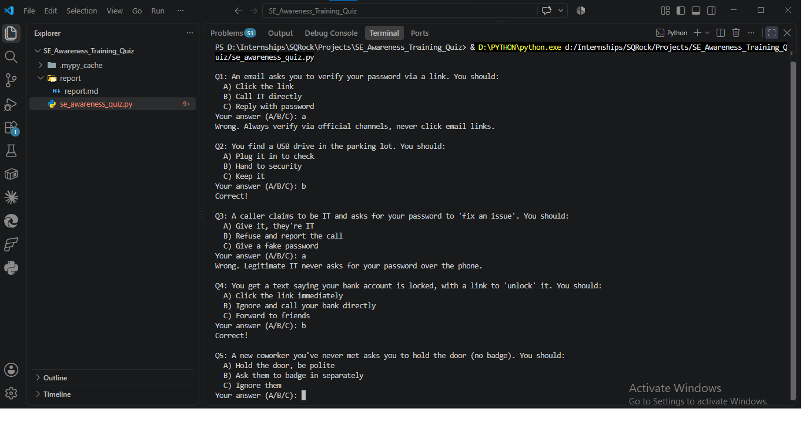
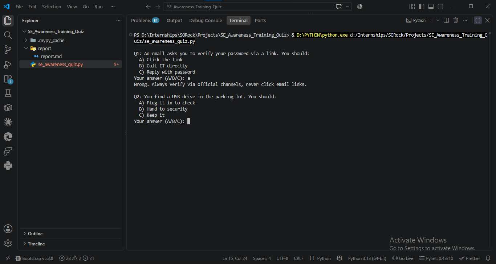
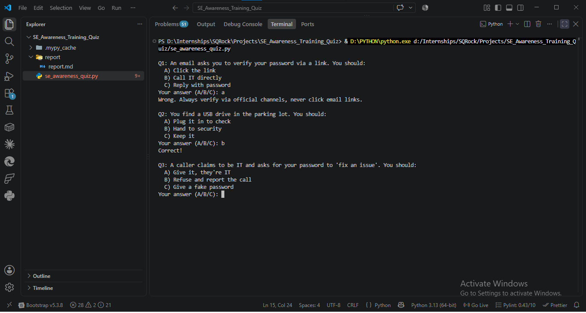

# SE Awareness Training Module — Report

**Analyst:** Mudasir Zia | **Date:** 2026-08-19 | **Tool:** se_awareness_quiz.py

## Objective
Build a 10+ question CLI quiz engine covering SE attack scenarios, with score tracking exported to JSON.

## Screenshots








## Question Bank (10 Scenarios)

| # | Topic | Attack Type |
|---|---|---|
| 1 | Password verification link | Phishing |
| 2 | USB drive in parking lot | Baiting |
| 3 | Fake IT caller requesting password | Vishing |
| 4 | Bank account lock SMS | Smishing |
| 5 | Tailgating at door | Physical/Tailgating |
| 6 | CEO gift card request | BEC/CEO Fraud |
| 7 | Lookalike phishing domain | Phishing/Typosquatting |
| 8 | Unexpected zip attachment | Malware Delivery |
| 9 | LinkedIn stranger probing internal tools | OSINT/Pretexting |
| 10 | MFA protection mechanism | Defensive Control Knowledge |

## Test Run — Dummy Validation Pass
A second run answering "A" to all 10 questions was used specifically to validate the JSON export pipeline end-to-end (not as a real knowledge test).

**Result: 0/10 (0.0%)** — confirms:
- Score tracking correctly counts wrong answers
- `quiz_score_report.json` correctly logs every question, the answer given, correct answer, and per-question pass/fail
- Percentage calculation (`score/total * 100`) computes correctly at the 0% boundary

## JSON Output Structure (validated)
```json
{
  "timestamp": "2026-08-19 09:00:09.960172",
  "score": 0,
  "total": 10,
  "percentage": 0.0,
  "answers": [ /* 10 objects: question, your_answer, correct_answer, correct */ ]
}
```

## Coverage Assessment
All major SE vectors from the theory brief are represented: phishing (link + domain-based), vishing, smishing, baiting, tailgating (physical), BEC/pretexting, malware delivery, and one defensive-knowledge check (MFA) — balances "spot the attack" questions with "know the defense" questions, matching how real awareness platforms (KnowBe4) structure training modules.

## Deliverable Status
- ✅ 10+ questions (exactly 10, one per major SE category)
- ✅ Score tracking with immediate feedback + explanation on wrong answers
- ✅ Score report saved to JSON with full per-question breakdown