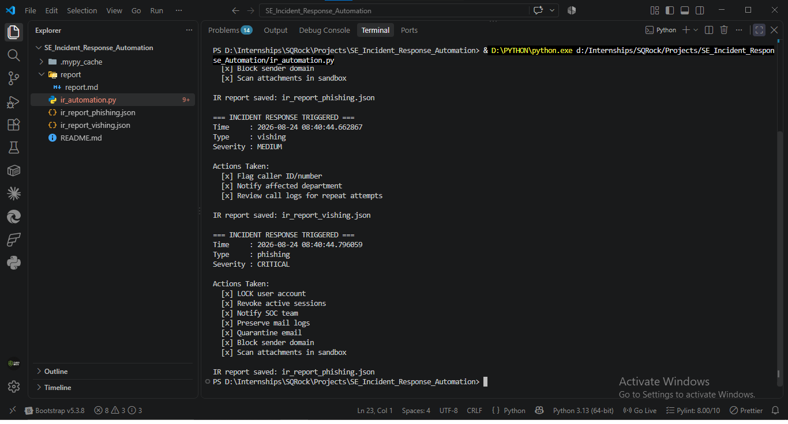
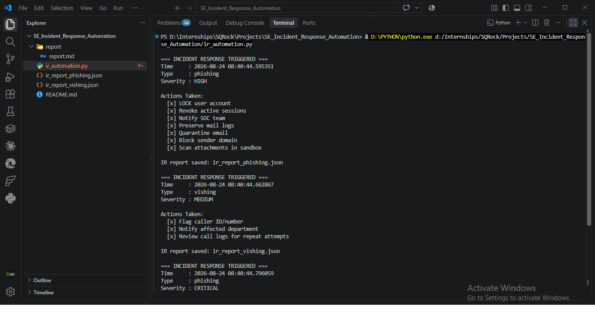
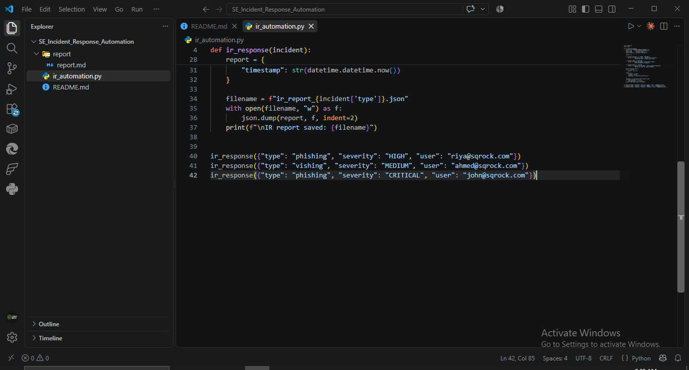
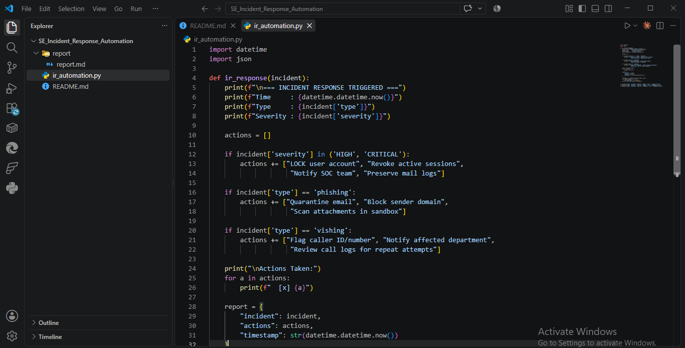
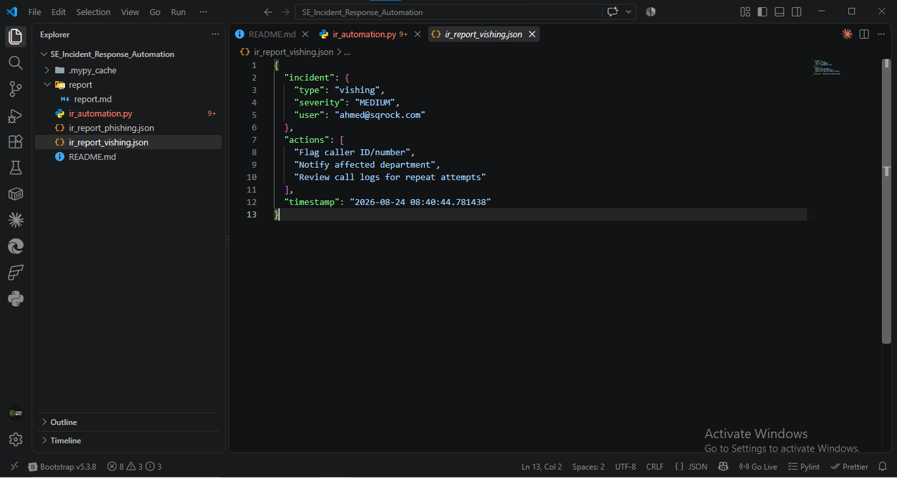
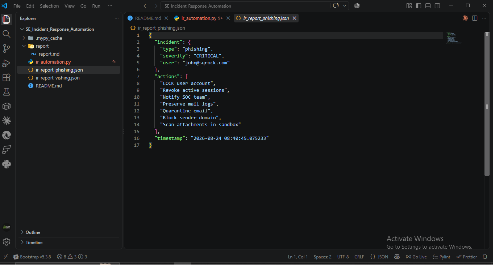

# SE Incident Response Plan — Report

**Analyst:** Mudasir Zia | **Date:** 2026-08-24 | **Tool:** ir_automation.py

## Objective
Build an IR automation script that triggers containment actions based on incident type/severity, and produce a 1-page IR playbook.

## Screenshots

## Test Runs (3 Incidents)

| Incident | Type | Severity | Actions Triggered |
|---|---|---|---|
| 1 | phishing | HIGH | Lock account, revoke sessions, notify SOC, preserve mail logs, quarantine email, block sender domain, scan attachments |
| 2 | vishing | MEDIUM | Flag caller ID, notify department, review call logs |
| 3 | phishing | CRITICAL | Same 7 actions as Incident 1 (severity HIGH/CRITICAL both trigger full lockdown set) |

## Key Finding
Severity-based branching (`HIGH`/`CRITICAL`) and type-based branching (`phishing`/`vishing`) are independent — a MEDIUM vishing incident correctly skips account lockout (proportionate response), while both HIGH and CRITICAL phishing trigger identical full containment, showing the severity threshold — not the exact label — drives the lockdown decision.

## JSON Report Structure (validated across all 3 runs)
Each incident produces its own file (`ir_report_phishing.json`, `ir_report_vishing.json`) containing: incident details, full actions list, ISO timestamp — supports the deliverable's legal/compliance/insurance documentation requirement since each incident has an independent, timestamped audit trail rather than one overwritten file.

## MITRE Mapping
- **T1566 — Phishing** (Incidents 1, 3)
- **T1598 — Phishing for Information / Vishing** (Incident 2)

---

## 1-Page IR Playbook — Social Engineering Incidents

**Trigger:** Any confirmed or suspected SE incident (phishing click, vishing call, smishing report, suspicious email rule, credential exposure).

**Phase 1 — Preparation** *(ongoing, not per-incident)*
- Maintain updated contact list for SOC, IT, legal, affected department heads
- Pre-approved containment actions (account lockout, email quarantine) ready to execute without delay

**Phase 2 — Identification**
- Confirm incident type (phishing / vishing / smishing / pretexting) and severity (LOW/MEDIUM/HIGH/CRITICAL)
- Identify affected user(s) and asset(s)

**Phase 3 — Containment** *(automated by this script for HIGH/CRITICAL)*
- Lock affected user account
- Revoke active sessions
- Quarantine malicious email (if phishing)
- Block sender domain (if phishing)
- Flag caller ID (if vishing)

**Phase 4 — Eradication**
- Remove malicious email from all mailboxes org-wide (not just affected user)
- Reset affected credentials
- Scan for persistence (forwarding rules, unauthorized OAuth grants)

**Phase 5 — Recovery**
- Restore account access after verification
- Monitor affected account for 7–14 days post-incident

**Phase 6 — Lessons Learned**
- Document root cause and gap that allowed the SE attempt to reach the user
- Update awareness training content based on the specific pretext used
- File JSON incident report (auto-generated by this script) for compliance/insurance records

**Escalation Rule:** Any CRITICAL severity incident triggers immediate SOC + management notification regardless of incident type.