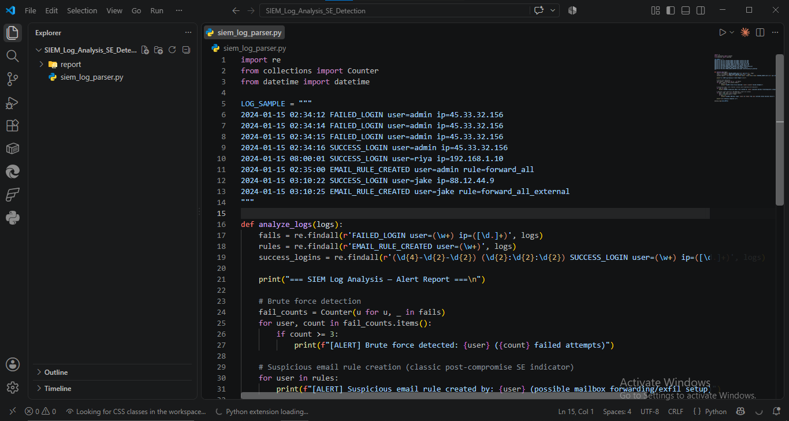
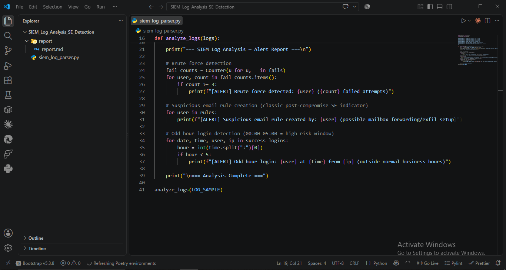
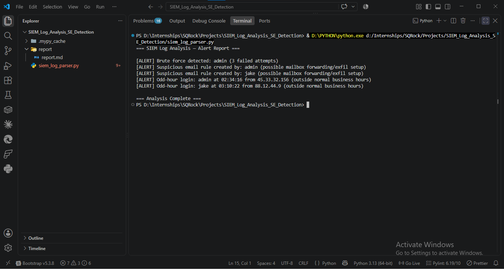

# SIEM Log Analysis for SE Attack Detection — Report

**Analyst:** Mudasir Zia | **Date:** 2026-08-19 | **Tool:** siem_log_parser.py

## Objective
Parse sample security logs and flag SE-related anomalies: brute force, suspicious email rules, odd-hour access.

## Screenshots

## Sample Log (8 events)

    2024-01-15 02:34:12 FAILED_LOGIN user=admin ip=45.33.32.156
    2024-01-15 02:34:14 FAILED_LOGIN user=admin ip=45.33.32.156
    2024-01-15 02:34:15 FAILED_LOGIN user=admin ip=45.33.32.156
    2024-01-15 02:34:16 SUCCESS_LOGIN user=admin ip=45.33.32.156
    2024-01-15 08:00:01 SUCCESS_LOGIN user=riya ip=192.168.1.10
    2024-01-15 02:35:00 EMAIL_RULE_CREATED user=admin rule=forward_all
    2024-01-15 03:10:22 SUCCESS_LOGIN user=jake ip=88.12.44.9
    2024-01-15 03:10:25 EMAIL_RULE_CREATED user=jake rule=forward_all_external

## Alerts Generated

| Alert Type | User | Detail |
|---|---|---|
| Brute Force | admin | 3 failed attempts, ip=45.33.32.156 |
| Suspicious Email Rule | admin | rule=forward_all |
| Suspicious Email Rule | jake | rule=forward_all_external |
| Odd-Hour Login | admin | 02:34:16 from 45.33.32.156 |
| Odd-Hour Login | jake | 03:10:22 from 88.12.44.9 |

## Attack Chain Reconstruction
Correlating the alerts tells a story beyond any single log line:
1. **02:34** — `admin` brute-forced 3 times, then succeeded on the same IP (`45.33.32.156`)
2. **02:35** — Immediately after success, `admin` creates a `forward_all` email rule — classic post-compromise mailbox exfiltration setup
3. **03:10** — `jake` logs in successfully at an odd hour and immediately sets up `forward_all_external` — same pattern, second account, suggests lateral movement or a second compromised credential from the same campaign

`riya`'s login (08:00, business hours, no rule created) is the only clean baseline event — included intentionally to show the parser doesn't false-positive on normal activity.

## Key Finding
The email-rule-creation alert is the highest-value indicator here — brute force alone is noisy and common, but a forwarding rule created within 60 seconds of a successful login is a strong, low-noise signal of account takeover, not just failed guessing.

## MITRE Mapping
- **T1110 — Brute Force** (admin failed login sequence)
- **T1114.003 — Email Forwarding Rule** — both `forward_all` and `forward_all_external` rules map directly here

## Recommendation
Alert priority should weight email-rule-creation events higher than raw failed-login counts — failed logins alone generate high false-positive volume, but forwarding-rule creation immediately post-login is a near-definitive compromise indicator.