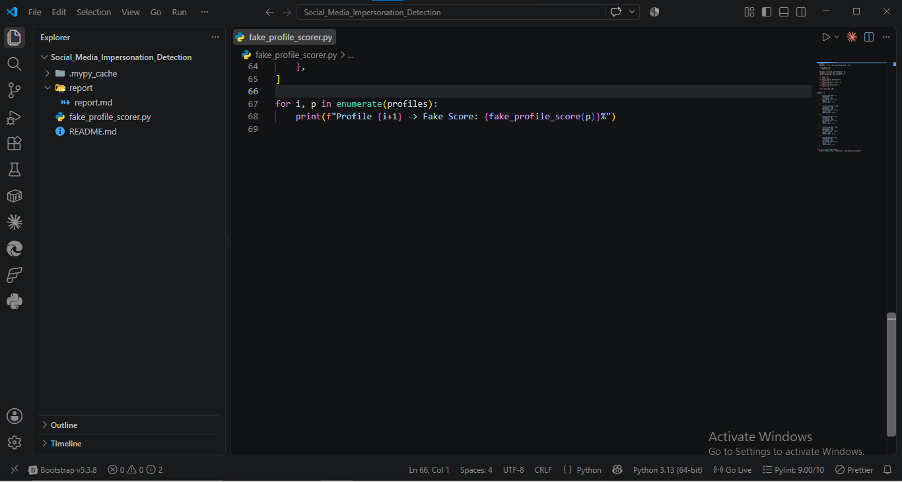
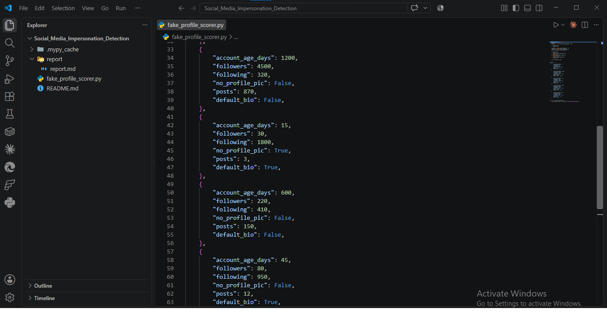
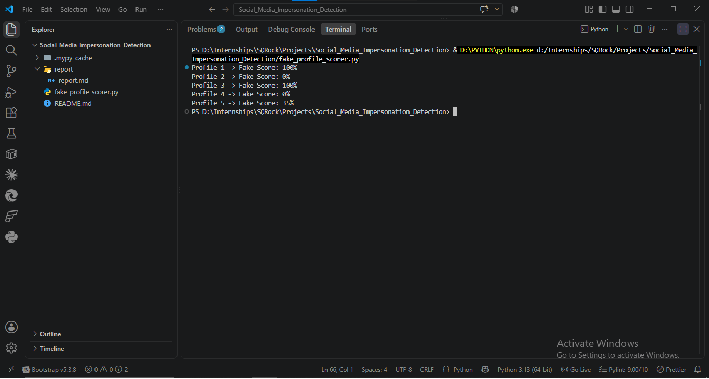
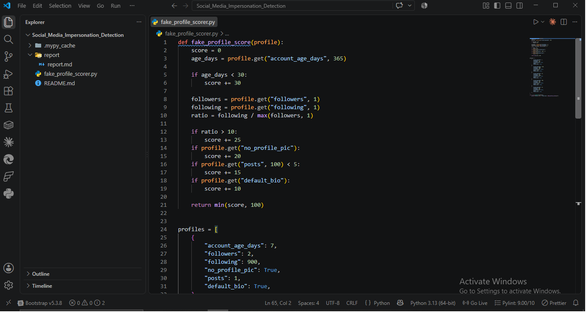

# Report: Social Media Impersonation & Fake Profile Detection

## Objective
Detect fake/bot social profiles using behavioral heuristics — build a scoring function that evaluates account signals commonly associated with impersonation and bot activity.

## Theory
- **Fake profiles** are used to build trust before social engineering attacks (catfishing, phishing, romance scams).
- **Bot signals**: low follower:following ratio (mass-following, few followers back), generic/default name, newly created account.
- **Impersonation**: cloned profile photo from a real person, username similar to a legitimate account (typosquatting on identity).

## Scoring Logic
| Signal | Condition | Points |
|--------|-----------|--------|
| New account | age < 30 days | +30 |
| High following ratio | following/followers > 10 | +25 |
| No profile picture | true | +20 |
| Low post count | posts < 5 | +15 |
| Default bio | true | +10 |

Score capped at 100%.

## Sample Data
5 simulated profiles covering a spread of legit vs. suspicious signal combinations.

## Execution

## Results

| Profile | Age (days) | Followers | Following | Ratio | No Pic | Posts | Default Bio | Score |
|---------|-----------|-----------|-----------|-------|--------|-------|--------------|-------|
| 1 | 7 | 2 | 900 | 450.0 | Yes | 1 | Yes | 100% |
| 2 | 1200 | 4500 | 320 | 0.07 | No | 870 | No | 0% |
| 3 | 15 | 30 | 1800 | 60.0 | Yes | 3 | Yes | 100% |
| 4 | 600 | 220 | 410 | 1.86 | No | 150 | No | 0% |
| 5 | 45 | 80 | 950 | 11.9 | No | 12 | Yes | 35% |

## Analysis
- **Profile 1 & 3**: max score (100%) — new accounts, extreme following ratios, no profile pic, near-zero posts. Textbook bot/fake pattern.
- **Profile 2 & 4**: 0% — established accounts, healthy follower base, normal ratio, active posting. Clean legit signal.
- **Profile 5**: 35% — mid-risk. Ratio (11.9) just clears the >10 threshold, plus default bio, but has a profile pic and account age >30 days — likely a real but low-effort/inactive account, not necessarily malicious. Shows the scorer isn't binary — mid-range scores need human review, not auto-flagging.

## MITRE ATT&CK Mapping
| TTP ID | Tactic | Technique |
|--------|--------|-----------|
| T1585.001 | Resource Development | Establish Accounts: Social Media Accounts |
| T1589 | Reconnaissance | Gather Victim Identity Information |

## Detection / Defense Notes
- Heuristic scoring is a first-pass triage tool, not a definitive verdict — false positives possible (new legit users, privacy-conscious users with no pic).
- Production improvement: add reverse image search on profile photo (detect stock/stolen images), username similarity check (Levenshtein distance) against known real accounts.
- Analyst workflow: score > 70% → manual review queue; score > 90% → auto-flag for platform trust & safety team.

## Deliverable Status
✅ Script with scoring function
✅ Analysis of 5 simulated profile samples