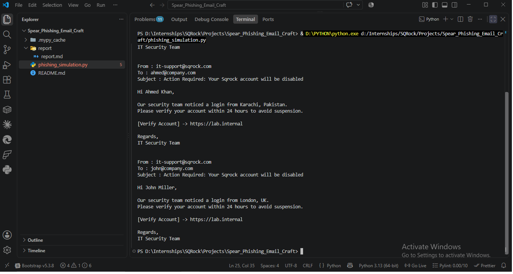
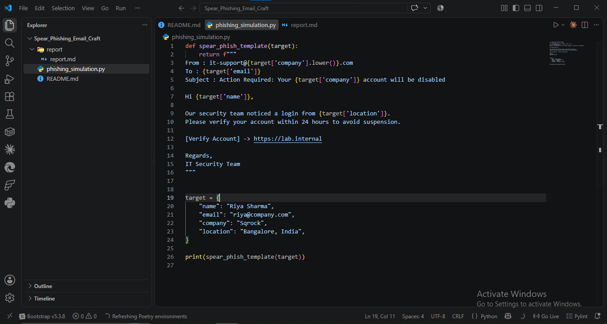
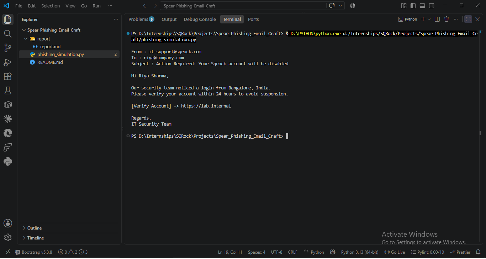
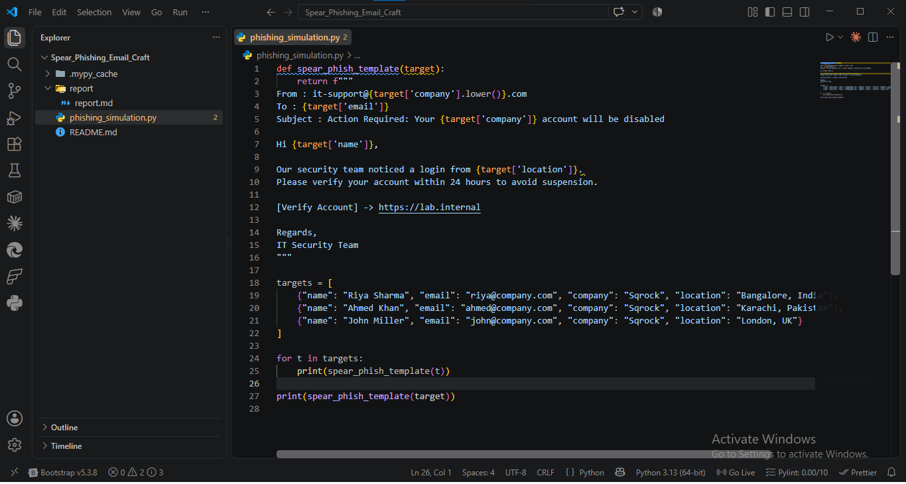
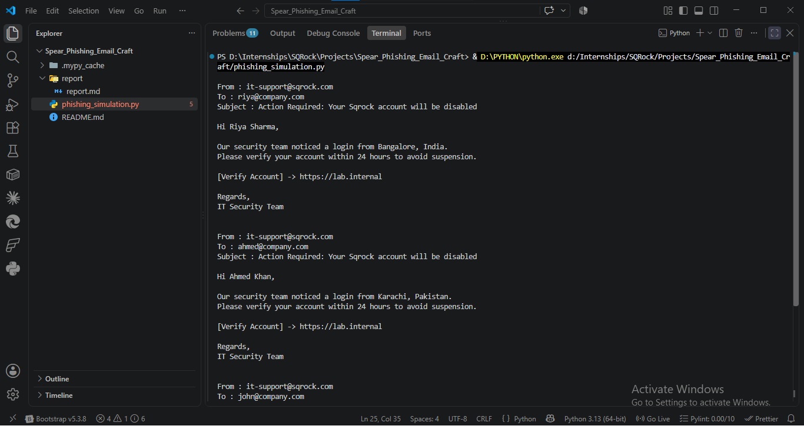

# Spear Phishing Email Craft — Report

**Analyst:** Mudasir Zia | **Date:** 2026-08-12 | **Tool:** phishing_simulation.py

## Objective
Build a template engine generating 3 personalized spear-phishing awareness emails, then document DMARC/SPF/DKIM defenses.

## Screenshots

## Generated Emails (3 Targets)

| Target | Location | Personalization Hook |
|---|---|---|
| Riya Sharma | Bangalore, India | "login from Bangalore, India" |
| Ahmed Khan | Karachi, Pakistan | "login from Karachi, Pakistan" |
| John Miller | London, UK | "login from London, UK" |

All 3 share: spoofed sender `it-support@sqrock.com`, identical urgency subject, identical fake verify link `https://lab.internal`.

## Spear Phishing Elements Present
- **Spoofed sender**: `it-support@sqrock.com` — mimics internal IT, not externally verifiable without SPF/DKIM checks
- **Personal hook**: real name + real location per target = high believability
- **Urgency**: "24 hours to avoid suspension" — classic scarcity/fear trigger
- **Malicious link placeholder**: `[Verify Account] -> https://lab.internal` — real attacks use lookalike domains here

## Key Finding
Location field is the strongest personalization lever — a generic "unusual login" email is easy to dismiss, but "login from Karachi, Pakistan" (a real, plausible location for that target) creates false urgency because it sounds like accurate security telemetry, not a mass-blast template.