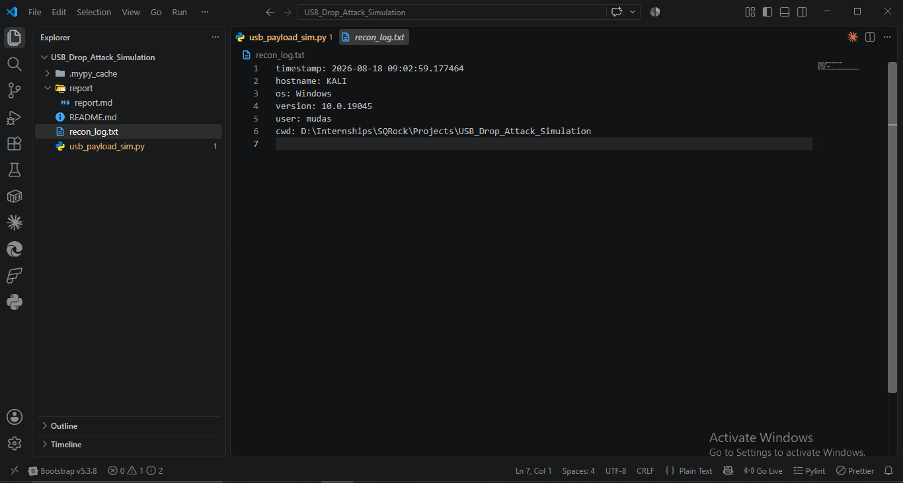
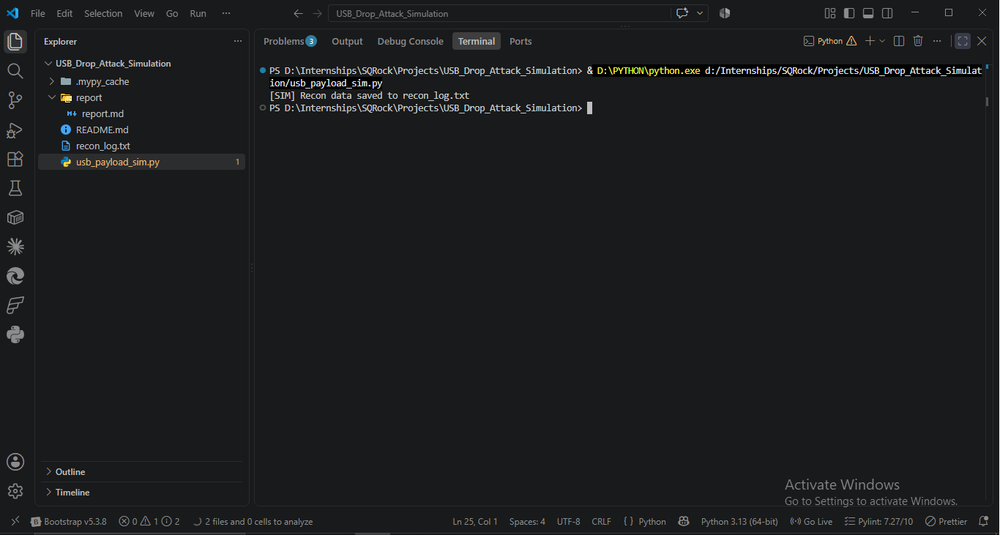
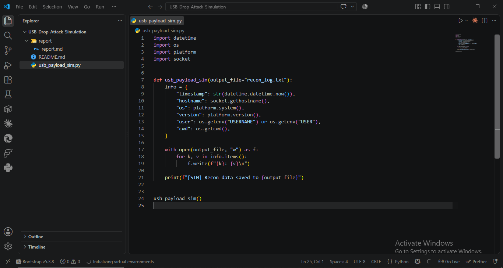

# Report: USB Drop Attack Simulation

## Objective
Simulate a USB drop payload (awareness-focused) using Python AutoRun logic — demonstrate what a real payload collects on execution without any malicious action.

## Theory
- **USB drop attack**: attacker leaves infected USB drives in target locations (parking lots, lobbies) hoping an employee plugs it in.
- **AutoRun abuse**: malicious script auto-executes when USB is inserted (legacy Windows AutoRun/AutoPlay feature, largely disabled by default since Windows 7+).
- **Defense**: disable AutoRun via Group Policy, endpoint DLP (Data Loss Prevention) to block unauthorized USB execution, user awareness training on "found" USB drives.

## Setup
`usb_payload_sim.py` uses only Python stdlib (`platform`, `socket`, `os`, `datetime`) — no external dependencies, no network activity, no persistence mechanism. Purely logs local system recon data to a text file.

## Execution

### Source code

### Run
Executed the script directly.

### Output — recon_log.txt

Captured fields:

    timestamp: 2026-08-18 09:02:59.177464
    hostname: KALI
    os: Windows
    version: 10.0.19045
    user: mudas
    cwd: D:\Internships\SQRock\Projects\USB_Drop_Attack_Simulation

## MITRE ATT&CK Mapping
| TTP ID | Tactic | Technique |
|--------|--------|-----------|
| T1091 | Initial Access | Replication Through Removable Media |
| T1082 | Discovery | System Information Discovery |
| T1033 | Discovery | System Owner/User Discovery |

## Detection / Defense Notes
- **Prevention**: Disable AutoRun/AutoPlay via GPO (`NoDriveTypeAutoRun` registry key), disable USB storage class at endpoint level for high-risk roles.
- **Detection**: EDR/Sysmon Event ID 1 (process creation) correlated with removable media insertion (Event ID 6416 on Windows) — flag any executable run within seconds of USB mount.
- **Policy**: mandatory "found media" reporting policy, physical security awareness training, USB port blocking via endpoint DLP for non-approved devices.
- **User awareness**: never plug in unknown USB drives — primary control since technical controls can be bypassed by social engineering.

## Folder structure:
USB_Drop_Attack_Simulation/
├── usb_payload_sim.py
├── README.md
└── report/
    ├── report.md
    ├── recon_log.txt
    ├── u1.png
    ├── u2.png
    ├── u3.png
    └── u4.png

## Deliverable Status
✅ Simulated recon output file generated
✅ Write-up on USB drop prevention policy