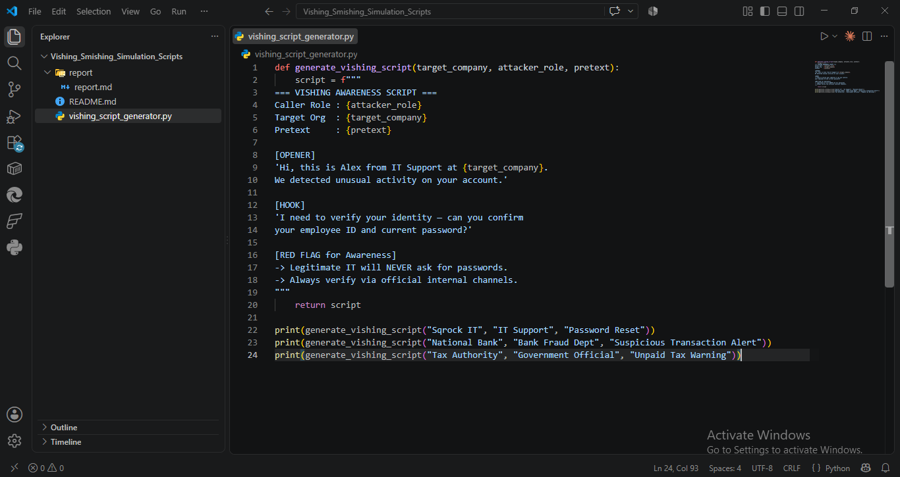
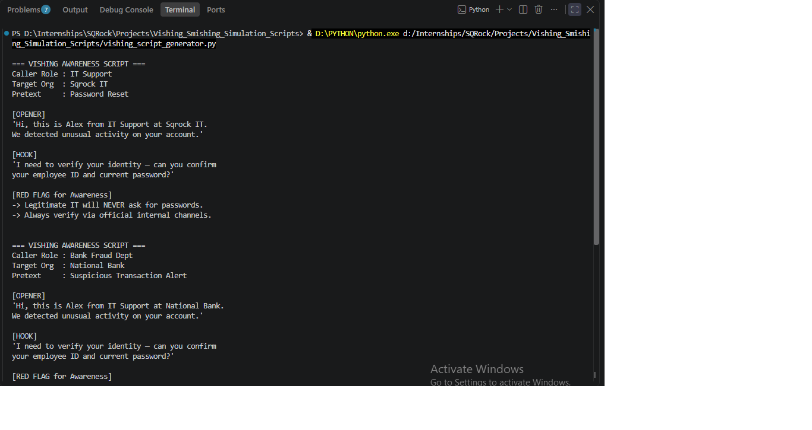
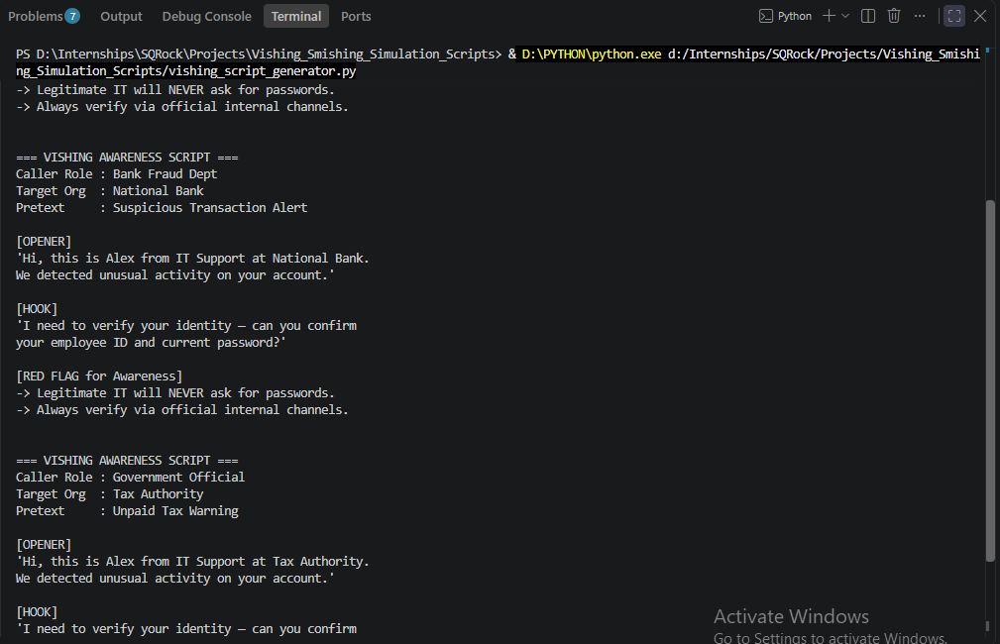
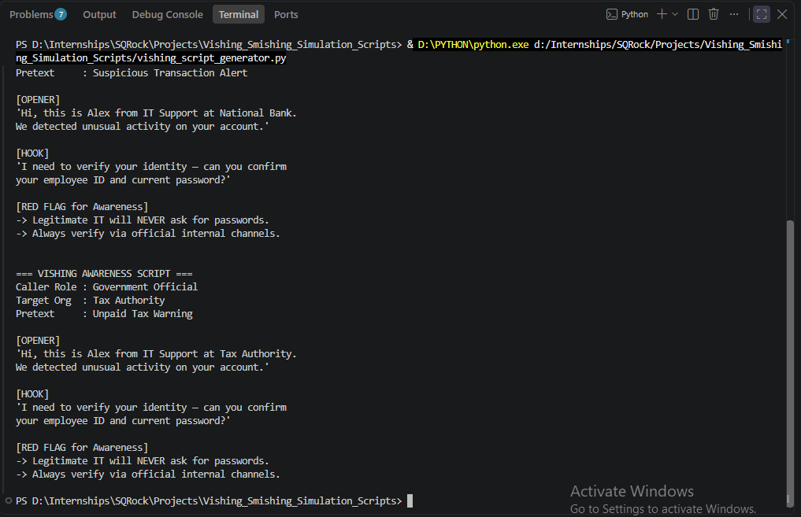

# Vishing & Smishing Simulation Scripts — Report

**Analyst:** Mudasir Zia | **Date:** 2026-08-12 | **Tool:** vishing_script_generator.py

## Objective
Build a script generator producing 3 distinct vishing awareness-training scripts, then analyze the psychological triggers each uses.

## Screenshots

## Generated Scripts (3 Pretexts)

| Pretext | Caller Role | Target Org | Hook |
|---|---|---|---|
| Password Reset | IT Support | Sqrock IT | Fake "unusual activity," requests employee ID + password |
| Suspicious Transaction Alert | Bank Fraud Dept | National Bank | Same hook, banking-authority framing |
| Unpaid Tax Warning | Government Official | Tax Authority | Same hook, government-authority framing |

## Psychological Triggers — Analysis

| Trigger | How Used | Why It Works |
|---|---|---|
| **Authority** | Caller claims to be IT/Bank/Government | People comply faster with perceived institutional power, skip verification |
| **Urgency/Fear** | "Unusual activity," "unpaid tax warning" | Panic short-circuits critical thinking — victim acts before verifying |
| **Liking** | Friendly first-name intro ("Alex") | Humanizes the attacker, lowers guard vs. a faceless threat |
| **Scarcity (implied)** | Framing as time-sensitive account/legal issue | Pushes immediate action, discourages "I'll call back later" |

## Key Finding
All 3 pretexts reuse the identical hook structure (request employee ID + password) — proves the *pretext* (who they claim to be) changes, but the actual attack payload (credential harvesting) stays constant. This is realistic: attackers reuse scripts across targets, only swapping the authority figure to match the victim's likely trust anchors.

## Red Flag (Training Takeaway)
Legitimate IT/bank/government never request passwords over phone. Always verify via official channels (callback to published number, not one given by caller).